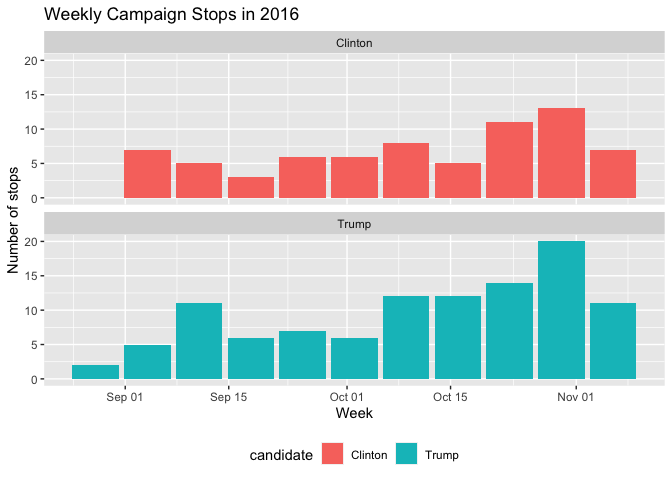

Belen Rugerio
================

## Fall 2021

My first semester of senior year I took **SDS 192: Introduction to Data
Science**. Over the course of the semester we learned about many topics,
from data wrangling to data visualization. The following is an overview
of the coursework I completed for the class.

## Data Wrangling

The following is a data wrangling exercise using data from the Titanic
about survivors.

This code downloads ths csv file and wrangles the data to display a
table showing the count of surivors and the numer of desceased.

``` r
titanic <- read_csv("https://rudeboybert.github.io/SDS192/static/PS/titanic.csv")
```

    ## Rows: 2201 Columns: 5

    ## ── Column specification ────────────────────────────────────────────────────────
    ## Delimiter: ","
    ## chr (4): Class, Sex, Age, Survived
    ## dbl (1): passenger_number

    ## 
    ## ℹ Use `spec()` to retrieve the full column specification for this data.
    ## ℹ Specify the column types or set `show_col_types = FALSE` to quiet this message.

``` r
survival <- titanic %>% group_by(Survived) %>%  count(Survived)
survival <- rename(survival, Count=n) 
survival
```

    ## # A tibble: 2 × 2
    ## # Groups:   Survived [2]
    ##   Survived Count
    ##   <chr>    <int>
    ## 1 No        1490
    ## 2 Yes        711

Now that dataframe is further grouped by sex to differentiate the
survivors by gender assigned at birth.

``` r
survival_by_sex <- titanic %>% group_by(Sex) %>% count(Survived) 
survival_by_sex <- rename(survival_by_sex, Count=n)  
survival_by_sex
```

    ## # A tibble: 4 × 3
    ## # Groups:   Sex [2]
    ##   Sex    Survived Count
    ##   <chr>  <chr>    <int>
    ## 1 Female No         126
    ## 2 Female Yes        344
    ## 3 Male   No        1364
    ## 4 Male   Yes        367

## Data Visualization

The following is a barplot showing the campaign stops for the 2016
presidential candidates from September to Noveber, obtained from the
package fivethirtyeight.

    ## 
    ## Attaching package: 'lubridate'

    ## The following objects are masked from 'package:base':
    ## 
    ##     date, intersect, setdiff, union

    ## `summarise()` has grouped output by 'candidate'. You can override using the `.groups` argument.

<!-- -->
